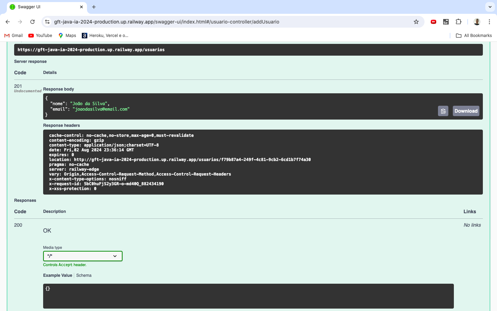

# Implementação

Este projeto utiliza como base a Agenda de Contatos, projeto desenvolvido como parte das entregas dos desafios do bootcamp e que pode ser acessado em [lab-desafio_3-padroes-projeto](https://github.com/patrick-tobias/2024-dio-gft_desenvolvimento_java_com_ia/tree/main/lab-desafio_3-padroes-projeto), e sinaliza a conclusão do bootcamp, com o deploy da aplicação em nuvem, utilizando [railway](https://railway.app/).

## Diagrama de Classes


O diagrama acima é a representação da estrutura de classes do sistema e foi gerado com o auxílio da IA Generativa. Para saber mais sobre o diagrama e da sintaxe [mermaid](https://mermaid.js.org/).

## Alterações realizadas Projeto Inicial

#### Validações customizadas via anotação
Foram criadas anotações customizadas, para a validação de dados de entrada, que são utilizadas em combinação com as anotações do [Jakarta Validation](https://beanvalidation.org/), implementado através do [Hibernate Validator](https://hibernate.org/validator/).

No Exemplo, a anotação `@CepBrasileiro`, implementa a validação de um CEP brasileiro, antes do processamento desse dado.

```java
@Constraint(validatedBy = CepBrasileiroValidator.class)
@Target(ElementType.FIELD)
@Retention(RetentionPolicy.RUNTIME)
public @interface CepBrasileiro {
  String message() default "CEP inválido ou fora de formatação. Utilize apenas números.";
  Class<?>[] groups() default {};
  Class<? extends Payload>[] payload() default {};
}
```

Para fins de estudo, a lógica de validação de CEP implementada foi simples e verifica somente se uma sequência de caracteres possui 8 dígitos.

```java
public class CepBrasileiroValidator implements ConstraintValidator<CepBrasileiro, String>{

  @Override
  public boolean isValid(String value, ConstraintValidatorContext context) {
    if(value == null)
      return false;
    
    return Pattern.matches("\\d{8}", value);
  }
}
```

Outra anotação criada com o mesmo propósito foi `@TelefoneBrasileiro`, que implementa a validação de um número de telefone.

#### Testes automatizados com JUnit
Com Gradle, o processo de *build* padrão envolve, além da compilação, a execução de testes. Para fins de estudos e prática de testes automatizados, foi implementado testes nas camadas **Controller** e **Service**, para o contexto de Usuários.

#### Configuração do Projeto

- **Versão do Java**

    O projeto foi inicialmente desenvolvido com a versão 21 do Java. Utilizando railway, foi encontrado um entrave nas versões do Java e a solução encontrada para contornar a situação foi realizar o "downgrade" do Java para a versão 17.

- **Spring Controller Advice**

    Foi atualizado a classe Advice do Spring, que trata as exceções que estão sujeitas o projeto e as retorna com uma mensagem mais "amigável" ao usuário cliente da API.

## Santander Dev Week 2023 Java API

Encontre mais sobre o desafio no endereço:

```web
    https://github.com/digitalinnovationone/santander-dev-week-2023-api
```

## Considerações Finais

É possível que a aplicação já não esteja no ar no momento em que você visualize esse repositório.

Por isso, capturei algumas imagens para ilustrar o funcionamento da API online, utilizando railway. </br>
URL: `https://gft-java-ia-2024-production.up.railway.app`

1) status do projeto em railway.app


2) Swagger: `https://gft-java-ia-2024-production.up.railway.app/swagger-ui/index.html`


3) POST em /usuarios


4) POST em /login


5) Configuração de Token


6) POST em /contatos


7) GET em /contatos


8) SELECT em USUARIOS no railway, persistência de dados


9) SELECT em CONTATOS no railway, persistência de dados

